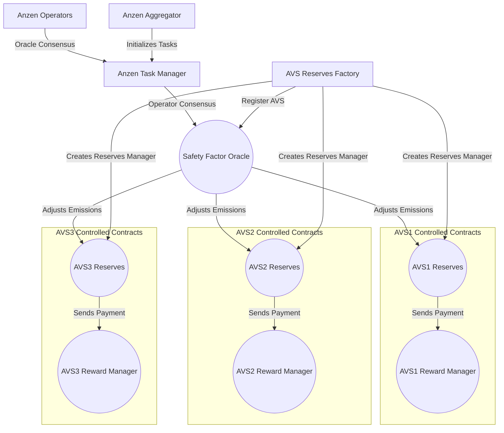

## Smart Contract Architecture



### Build

```shell
$ forge build
```

### Test

```shell
$ forge test
```

### Format

```shell
$ forge fmt
```

### Gas Snapshots

```shell
$ forge snapshot
```

### Anvil

```shell
$ anvil
```

### Deploy

```shell
$ make deploy-anzen-contracts-to-anvil-and-save-state
```

### Help

```shell
$ forge --help
$ anvil --help
$ cast --help
```
